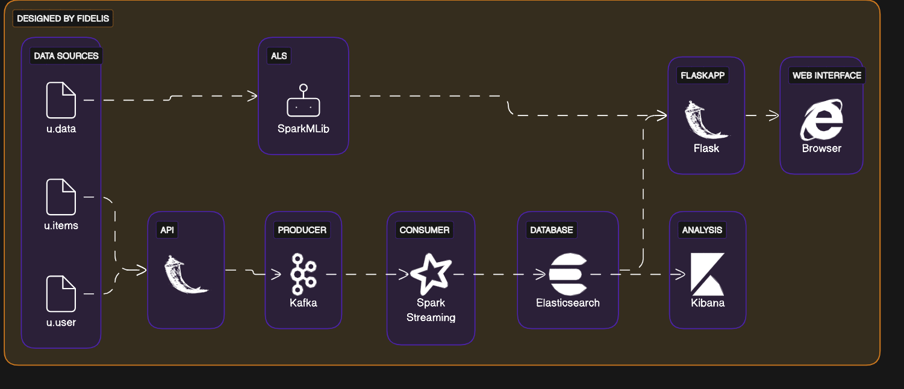

# Recommandation de Films Jay-Z Entertainment : Intégration de Big Data et IA

## Table des Matières
- [Description](#Description)
- [Structure du projet](#Installation)
- [Architecture du projet](#Structureduprojet)

## Description
Ce projet vise à intégrer l'analyse Big Data et l'apprentissage automatique pour améliorer les suggestions de films, en utilisant Apache Spark, Elasticsearch et une API Flask, afin d'offrir une expérience utilisateur personnalisée et dynamique.

## Installation
Pour executer le projet, assurez-vous d'avoir installée Docker
Puis executez le fichier .yml dans le dossier /config
Ensuite, executez le fichier api.py dans le dossier /data/scripts/
Demarrez le producer et le consumer dans le dossier /src/kafka/
Verifier si l'index est creée dans elasticsearch: dans le navigateur, allez a localhost:5601 et taper index dans la barre de recherche
Vous verrez la liste de vos index.
Visualisez le dashbord dans Kibana

Si vous souhaitez tester la plateforme de recommandation, executez le fichier app.py dans le dossier /src/FlaskApp

# Structure du projet
 
- `config/`
   - `docker-compose.yml`
   - `elastic cloud credentials`

- `data/`
   - `scripts/`
        - `api.py`

- `Documents/`
   - `Catalogue de donnees.pdf
   - `Gouvernance de donnees.pdf

- `media/`
   - `architecture.png`
   - `dashbord.png`
   - `plateforme.png`

- `src/`
   - `Analytics/`
      - `Analysis`
   - `FlaskApp/`
      - `_pycache_/`
      - `app.py`
   - `kafka/`
      - `consumer.py`
      - `producer.py`
   - `MachineLearning/`
      - `model/`
      - `ALS.py`
      - `test.py`
   - `tests/`
      - `elastic.py`
      - `elasticCloud.py`
      - `test.ipynb`
      - `topic.py`

- `.gitignore`
- `LICENSE`
- `README.md`